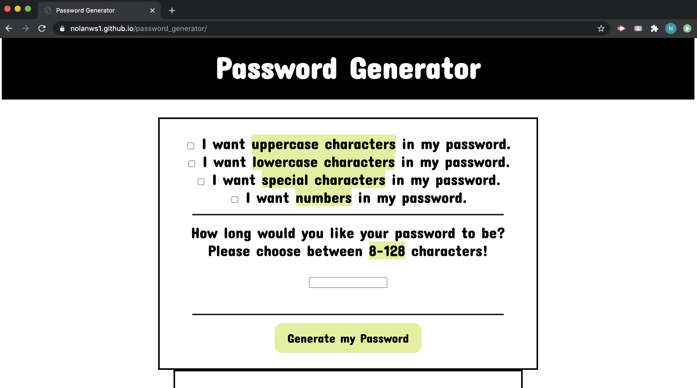
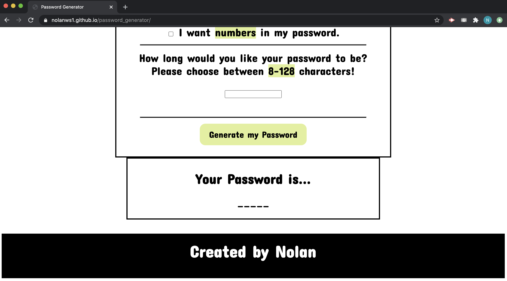

# password_generator
The purpose of this website is to provide the user with a randomized password of their desired length and character-type specification.

This projects features a single html page linked to a JS and a CSS:

The PASSWORD GENERATOR page contains a:

Header title with the project title.

A section with 4 check boxes asking for user's character-type specifications.

A section with a text input box asking for the user's desired password length.

A button for the user to push to generate their password output.

A seperate box section where the password will appear in a < p > tag element.

A footer with "created by Nolan"

This Site has been formated for iPhone(6/7/8/9/10/X), iPad, and most responsive web browsers.

## Getting started and deployment

This site can be accessed by clicking the link below...

https://nolanws1.github.io/password_generator/

## Built With
* HTML
* CSS
* JAVASCRIPT
* <a rel="stylesheet" href="https://fonts.google.com/">Google Fonts</a>

## Created by

Nolan Sanchez / UCR Extension Program Coding Bootcamp Student

## Screenshots

